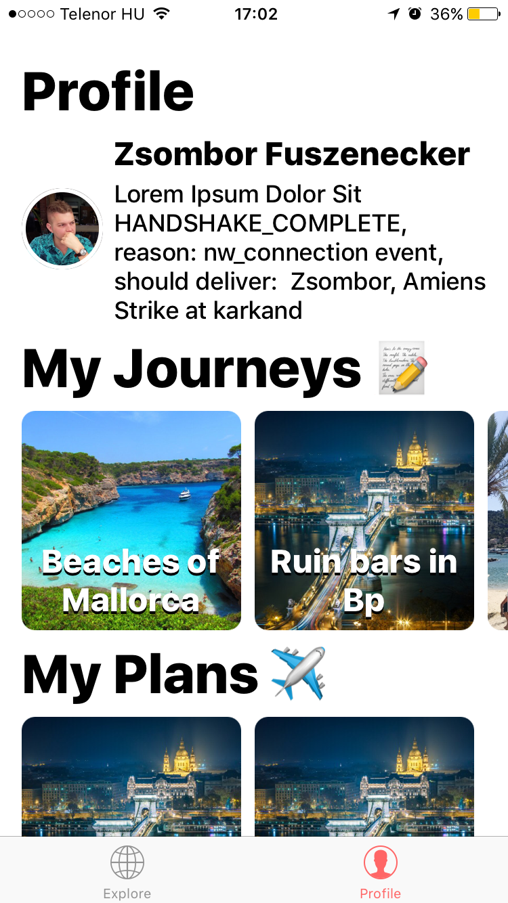
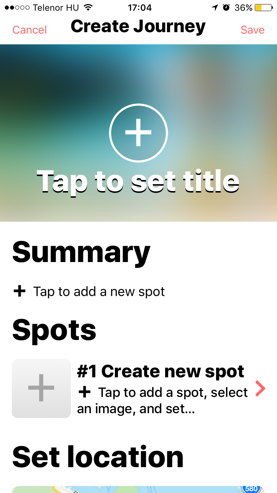
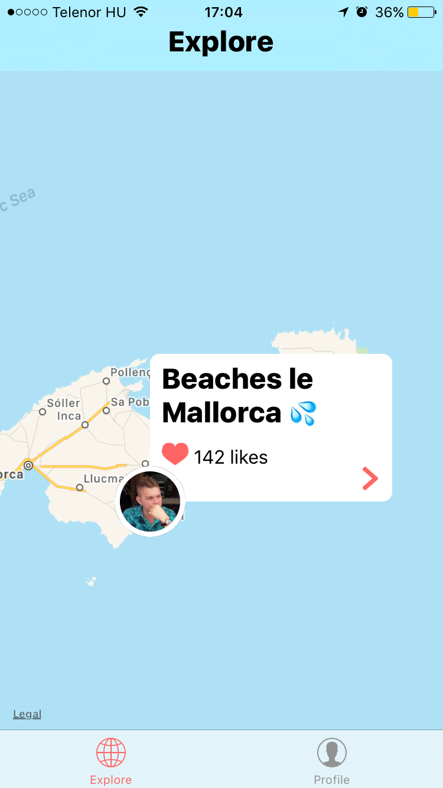
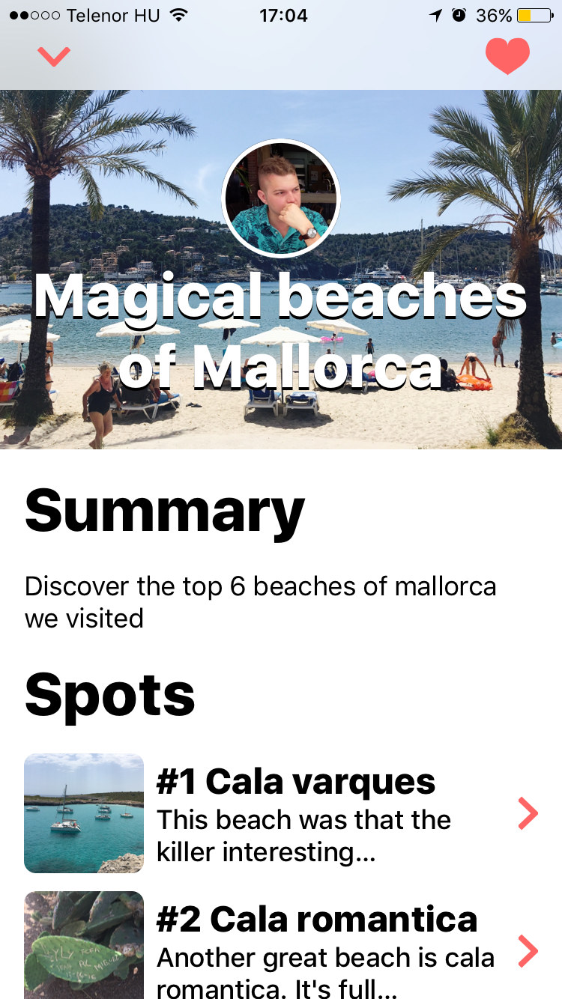

# Guidee, social travel inspiration app

#### Why?
##### TLDR: My travel planning takes too much time, because my travel lust needs more than visiting the common touristic places to get satisfied.
I realised in the last couple of months that even though I know which region/country I would like to visit in the future, I do not know where I would like to go exactly. Which spots are the one I would like to visit? I need the experience of other people.

----
I am not the usual tourist kind of person. I like to see places which are not well known. The best places are usually the ones that are hard to find, and is not full of people. I need to find those.

Using Youtube, Google Maps, Foursquare, Pinterest and Instagram, its possible for me to find these places, however its a pain. I takes too much time. 

My problem with Foursquare, and other review based apps is that its too objective. 4.5/5 stars with reviews like "Beautiful place, must visit".
I do not need this. I need the real human factor in it.

To do this, I need to identify myself with other people. Its not enough to see one review of a beach. I need to see what other places this person visited during his journey, and I would like to see the experience he had. After I see this, and I identify myself with someone I can finally know where I would like to go exactly.

#### The audience
* My main target uploading content are world travellers, travel vloggers.
* Target reader audience could be anyone who loves to travel to unsual but awesome places

#### The plan
The apps target audience is not the typical tourist, who wants to see the Eiffel tower and goes to Paris, and checks out 3 museums and the tower while staying in the hotel. Everyone can do that without another app. 

The app has to show places which are not widely known, "Hidden gems" if you wish. 

People love to collect. I for example love to categorise my travels in Google Photos into Albums, however there is no way for me to create a journey from it. I cannot add comments, or put albums in albums to make a journey...
With Guidee, I would be able to upload my travel journey into the app with images, and videos and pin the journey on the map. A journey has highlights (eg: unknown beach) which they can add a description and images/videos. Then I could share this with people I like, or just make it public if I will, and people could give their feedback.

Journeys can be commented on, made private, one could steal highlights from them to start and plan their own future journey. 

# Current state:
* The app has the Explore part mostly finished (Journeys of users show up on  the map)
* Journey View is done (The journeys root page), loading data from Firebase
* Highlights page is done, except for the highlights map view (Hihglight page inside a Journey page)
* Profile UI is done, and loading data from Firebase
* Creating a journey with images and highlights and pinning it on the map -> Live updating the Explore map with the new pin.

# Next steps:
* Creating a Journey should put it into the users journeys
* Liking a Journey
* Commenting on a Journey
* Map for the Highlight pages
* Creating a Plan
* Following someone.

#### images

